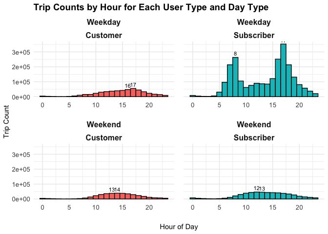
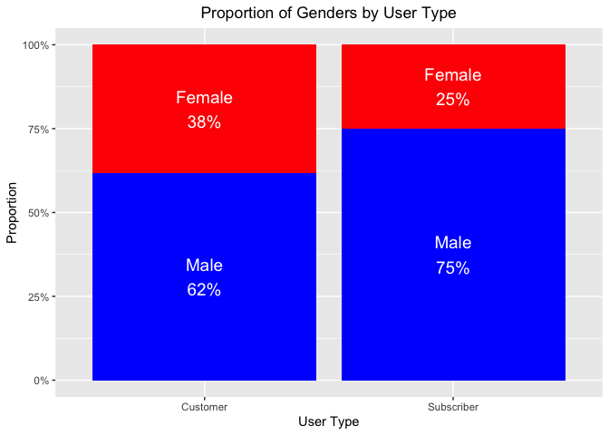

# Cyclistic Bike_Share User Analysis by R

## **Introduction**

This case study is a capstone project for my [Google Data Analyst Professional Certificate](https://www.coursera.org/account/accomplishments/specialization/certificate/4PMCRU98UADD). In this project, I employed data wrangling, analytical, and visualization skills to address a marketing problem for Cyclistic, a fictional bike share company in Chicago. 
 
Cyclistic has concluded that the company's future success depends on maximizing the number of annual memberships. Therefore, rather than creating a marketing campaign that targets all-new customers, the marketing team aims to convert more casial riders into members. The main goal of this project is to answer the question: **How do annual subscribers and casual customers use Cyclistic bikes differently?** From my insights, the marketing team will design a new marketing strategy to convert casual riders into annual members. 
 
### **Questions to be answered**

-   What are the proportions of subscribers and casual customers?
-   How do trip durations differ for subscribers and casual customers?
-   How do trip frequencies differ between weekdays and weekends for both groups?
-   Are there noticeable differences in trip purposes between members and casual riders?
-   What are the peak hours during weekdays and weekends for both subscribers and casual customers?
-   How does bike usage vary across different seasons for both subscribers and casual customers?
-   Which stations are more popular among subscribers and casual customers?
-   How do the demographics (e.g., birth year, gender) of subscribers compare to those of casual customers?

## **Visualizations**

See the complete background information and detailed analysis [here](https://github.com/peeweekiwi/Cyclistic/blob/main/cyclistic.md).

