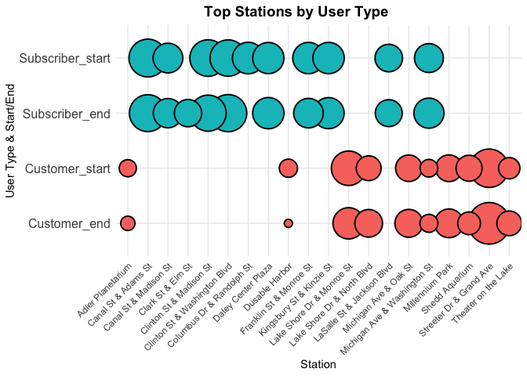

# Cyclistic Bike_Share User Analysis by R

## **Introduction**

This case study is a capstone project for my [Google Data Analyst Professional Certificate](https://www.coursera.org/account/accomplishments/specialization/certificate/4PMCRU98UADD). In this project, I employed data wrangling, analytical, and visualization skills to address a marketing problem for Cyclistic, a fictional bike share company in Chicago. 
 
Cyclistic has concluded that the company's future success depends on maximizing the number of annual memberships. Therefore, rather than creating a marketing campaign that targets all-new customers, the marketing team aims to convert more casial riders into members. The main goal of this project is to answer the question: **How do annual subscribers and casual customers use Cyclistic bikes differently?** From my insights, the marketing team will design a new marketing strategy to convert casual riders into annual members. 
 
### **Questions to be answered**

-   What are the proportions of subscribers and casual customers?
-   How do trip durations differ for subscribers and casual customers?
-   How do trip frequencies differ between weekdays and weekends for both groups?
-   Are there noticeable differences in trip purposes between members and casual riders?
-   What are the peak hours during weekdays and weekends for both subscribers and casual customers?
-   How does bike usage vary across different seasons for both subscribers and casual customers?
-   Which stations are more popular among subscribers and casual customers?
-   How do the demographics (e.g., birth year, gender) of subscribers compare to those of casual customers?

## **Visualizations**

## **Key Insights**

### **User Demographics**

-   Among all trips, casual customers outnumber subscribers by three to one.
-   Male users outnumber female users in both groups, but casual customers have a higher proportion of female users compared to subscribers.
-   The majority of users are born between 1980 and 2000. Casual customers are predominantly born between 1990 and 2000, while subscribers are mostly born between 1980 and 1990.

### **Trip Duration and Frequency**

-   Casual customers typically have longer trip durations (10-30 minutes) compared to subscribers (0-20 minutes).
-   Subscribers predominantly use Cyclistic on weekdays.
-   Casual users favor weekends.

### **Usage Patterns**

-   On weekdays, the peak hours for subscribers are 8 AM and 5 PM.
-   For casual customers, the peak hour on weekdays is 5 PM.
-   On weekends, the peak hours for both user types are after 12 PM.

### **Seasonal Trends**

-   Cyclistic is most popular during the summer and least popular in winter for both user types.

### **Popular Stations**

-   Popular stations differ significantly between user types.
    -   Casual customers frequent Streeter Dr & Grand Ave, Lake Shore Dr & Monroe St, and Millennium Park.
    -   Subscribers prefer Clinton St & Washington Blvd, Canal St & Adams St, and Clinton St & Madison St.

## Recommendations

1.  **Target Younger Audiences:** Since casual users are predominantly born between 1990 and 2000, create marketing campaigns that resonate with younger demographics. Use social media platforms like Instagram, TikTok, and Snapchat where this age group is highly active.

2. **Highlight Cost Savings:** Emphasize how subscribing can save money for frequent users, especially those who currently take longer trips as casual customers. Show comparative costs between paying per trip versus subscribing for unlimited shorter trips.

3.  **Offer Flexible Subscription Plans:** Introduce flexible subscription plans that cater to varying needs, such as weekend-only plans or limited ride packages, to appeal to casual users who may not ride daily.

4.  **Weekend Specials:** Since casual users favor weekends, create special weekend promotions for subscribers. Offer perks like extended ride times or discounts on weekend rides for subscribers.

5.  **Peak Hour Benefits:** Promote benefits for subscribers during peak hours, such as guaranteed bike availability or priority access during the busiest times.

6.  **Seasonal Promotions:** Launch seasonal campaigns that offer discounts or special benefits for new subscribers, especially during the summer when usage peaks. Highlight the advantages of being a subscriber during the high-demand season.

7.  **Station-Based Incentives:** Implement incentives at popular casual user stations (Streeter Dr & Grand Ave, Lake Shore Dr & Monroe St, and Millennium Park) to encourage sign-ups. For example, set up subscription kiosks with promotional offers or host events at these locations.

See the complete background information and detailed analysis [here](https://github.com/peeweekiwi/Cyclistic/blob/main/cyclistic.md).

