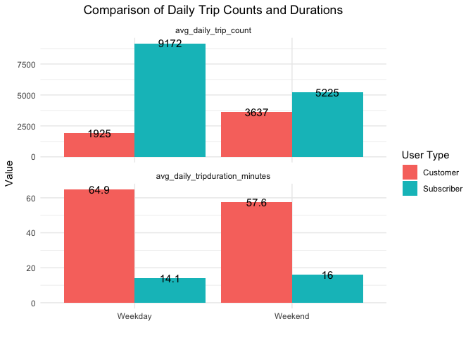
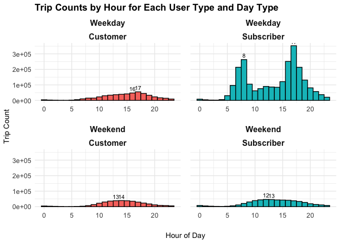
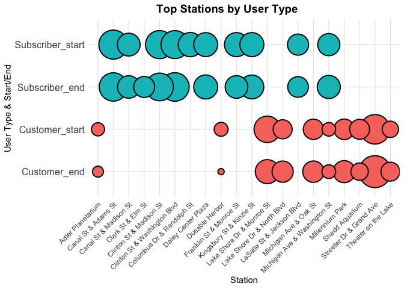
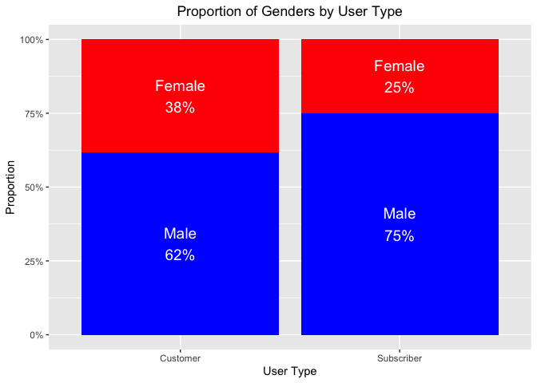
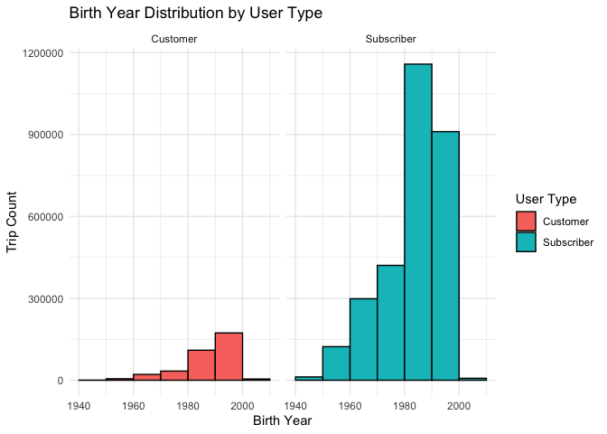

# Cyclistic Bike-Share User Analysis by R

**Author:** Adela Xu  
**Date:** 2024-07-12

## **Background**

### **About the company**

**Cyclistic:** A bike-share company based in Chicago, with a fleet of
5,824 bicycles that are geotracked and locked into a network of 692
stations across Chicago. The bikes can be unlocked from one station and
returned to any other station in the system anytime. There are two types
of users at Cyclistic: *annual members* and *casual customers*.

### **Business Scenario**

The company’s finance analysts have concluded that annual members are
much more profitable than casual riders. Thus, the marketing director
(my manager) has set a clear goal: Design marketing strategies aimed at
converting casual customers into annual subscribers. In order to do
that, the team needs to better understand:  

-   How annual subscribers and casual customers differ?
-   Why casual customers would buy a subscription?
-   How digital media could affect their marketing tactics? Our team is
    interested in analyzing the Cyclistic historical bike trip data to
    identify trends.

## **Ask Phase**

### **Business Tasks**

As a data analyst on the marketing team, my job is to answer the first
question: **How do annual subscribers and casual customers use Cyclistic
bikes differently?** I will present a detailed analysis supported by
data visualizations, share the key findings, and provide recommendations
accordingly.

### **Questions to be answered**

-   What are the proportions of subscribers and casual customers?
-   How do trip durations differ for subscribers and casual customers?
-   How do trip frequencies differ between weekdays and weekends for
    both groups?
-   Are there noticeable differences in trip purposes between members
    and casual riders?
-   What are the peak hours during weekdays and weekends for both
    subscribers and casual customers?
-   How does bike usage vary across different seasons for both
    subscribers and casual customers?
-   Which stations are more popular among subscribers and casual
    customers?
-   How do the demographics (e.g., birth year, gender) of subscribers
    compare to those of casual customers?

## **Prepare Phase**

I analyzed Cyclistic’s historical trip data from all four quarters of
2019 to identify trends. The data is downloaded from
[here](https://divvy-tripdata.s3.amazonaws.com/index.html) and is
provided by Motivate International Inc. under this
[license](https://divvybikes.com/data-license-agreement). Each of the
four files is contains twelve columns of data for all rides that
occurred between January 2019 and December 2019. The credibility of the
data source is confirmed.

## **Process Phase (Cleaning and Transformation)**

Load required libraries and set global options

    library(tidyverse)

    ## ── Attaching core tidyverse packages ──────────────────────── tidyverse 2.0.0 ──
    ## ✔ dplyr     1.1.4     ✔ readr     2.1.5
    ## ✔ forcats   1.0.0     ✔ stringr   1.5.1
    ## ✔ ggplot2   3.5.1     ✔ tibble    3.2.1
    ## ✔ lubridate 1.9.3     ✔ tidyr     1.3.1
    ## ✔ purrr     1.0.2     
    ## ── Conflicts ────────────────────────────────────────── tidyverse_conflicts() ──
    ## ✖ dplyr::filter() masks stats::filter()
    ## ✖ dplyr::lag()    masks stats::lag()
    ## ℹ Use the conflicted package (<http://conflicted.r-lib.org/>) to force all conflicts to become errors

    library(dplyr)
    library(ggplot2)
    library(lubridate)
    knitr::opts_chunk$set(
        echo = TRUE,
        message = FALSE,
        warning = FALSE
    )

Upload the four CSV files for the trip data of 2019

    Q1_2019 <- read.csv("Divvy_Trips_2019_Q1.csv")
    Q2_2019 <- read.csv("Divvy_Trips_2019_Q2.csv")
    Q3_2019 <- read.csv("Divvy_Trips_2019_Q3.csv")
    Q4_2019 <- read.csv("Divvy_Trips_2019_Q4.csv")

Review and compare column names of each file. While the names don’t have
to be in the same order, we want them to match perfectly before we use a
command to combine them into one file.

    colnames(Q1_2019)

    ##  [1] "trip_id"           "start_time"        "end_time"         
    ##  [4] "bikeid"            "tripduration"      "from_station_id"  
    ##  [7] "from_station_name" "to_station_id"     "to_station_name"  
    ## [10] "usertype"          "gender"            "birthyear"

    colnames(Q2_2019)

    ##  [1] "X01...Rental.Details.Rental.ID"                   
    ##  [2] "X01...Rental.Details.Local.Start.Time"            
    ##  [3] "X01...Rental.Details.Local.End.Time"              
    ##  [4] "X01...Rental.Details.Bike.ID"                     
    ##  [5] "X01...Rental.Details.Duration.In.Seconds.Uncapped"
    ##  [6] "X03...Rental.Start.Station.ID"                    
    ##  [7] "X03...Rental.Start.Station.Name"                  
    ##  [8] "X02...Rental.End.Station.ID"                      
    ##  [9] "X02...Rental.End.Station.Name"                    
    ## [10] "User.Type"                                        
    ## [11] "Member.Gender"                                    
    ## [12] "X05...Member.Details.Member.Birthday.Year"

    colnames(Q3_2019)

    ##  [1] "trip_id"           "start_time"        "end_time"         
    ##  [4] "bikeid"            "tripduration"      "from_station_id"  
    ##  [7] "from_station_name" "to_station_id"     "to_station_name"  
    ## [10] "usertype"          "gender"            "birthyear"

    colnames(Q4_2019)

    ##  [1] "trip_id"           "start_time"        "end_time"         
    ##  [4] "bikeid"            "tripduration"      "from_station_id"  
    ##  [7] "from_station_name" "to_station_id"     "to_station_name"  
    ## [10] "usertype"          "gender"            "birthyear"

Q2 dataset’s column names are different from the others. Rename columns
to make Q2 data consistent with the other 3 quarters’.

    Q2_2019 <- rename(Q2_2019 
                      ,trip_id = X01...Rental.Details.Rental.ID
                      ,start_time = X01...Rental.Details.Local.Start.Time
                      ,end_time = X01...Rental.Details.Local.End.Time
                      ,bikeid = X01...Rental.Details.Bike.ID
                      ,tripduration = X01...Rental.Details.Duration.In.Seconds.Uncapped
                      ,from_station_id = X03...Rental.Start.Station.ID
                      ,from_station_name = X03...Rental.Start.Station.Name
                      ,to_station_id = X02...Rental.End.Station.ID
                      ,to_station_name = X02...Rental.End.Station.Name
                      ,usertype = User.Type
                      ,gender = Member.Gender
                      ,birthyear = X05...Member.Details.Member.Birthday.Year
                      )

Combine the four datasets into one.

    all_trips <- bind_rows(Q1_2019, Q2_2019, Q3_2019, Q4_2019)

Remove any duplicate trips.

    all_trips <- all_trips %>% distinct()

Check for missing values in each column.

    missing_values <- colSums(is.na(all_trips) | all_trips == "")
    print(missing_values)

    ##           trip_id        start_time          end_time            bikeid 
    ##                 0                 0                 0                 0 
    ##      tripduration   from_station_id from_station_name     to_station_id 
    ##                 0                 0                 0                 0 
    ##   to_station_name          usertype            gender         birthyear 
    ##                 0                 0            559206            538751

Only gender and birthyear columns have missing values. 559206 rows with
missing gender, percentage 14.6%. 537801 rows with missing birthyear,
percentage 14.1%. Due to the high percentage of missing values in these
two columns, we will retain them for further analysis that does not
depend on these columns.

Check data structures of the combined dataset.

    str(all_trips)

    ## 'data.frame':    3818004 obs. of  12 variables:
    ##  $ trip_id          : int  21742443 21742444 21742445 21742446 21742447 21742448 21742449 21742450 21742451 21742452 ...
    ##  $ start_time       : chr  "2019-01-01 00:04:37" "2019-01-01 00:08:13" "2019-01-01 00:13:23" "2019-01-01 00:13:45" ...
    ##  $ end_time         : chr  "2019-01-01 00:11:07" "2019-01-01 00:15:34" "2019-01-01 00:27:12" "2019-01-01 00:43:28" ...
    ##  $ bikeid           : int  2167 4386 1524 252 1170 2437 2708 2796 6205 3939 ...
    ##  $ tripduration     : chr  "390.0" "441.0" "829.0" "1,783.0" ...
    ##  $ from_station_id  : int  199 44 15 123 173 98 98 211 150 268 ...
    ##  $ from_station_name: chr  "Wabash Ave & Grand Ave" "State St & Randolph St" "Racine Ave & 18th St" "California Ave & Milwaukee Ave" ...
    ##  $ to_station_id    : int  84 624 644 176 35 49 49 142 148 141 ...
    ##  $ to_station_name  : chr  "Milwaukee Ave & Grand Ave" "Dearborn St & Van Buren St (*)" "Western Ave & Fillmore St (*)" "Clark St & Elm St" ...
    ##  $ usertype         : chr  "Subscriber" "Subscriber" "Subscriber" "Subscriber" ...
    ##  $ gender           : chr  "Male" "Female" "Female" "Male" ...
    ##  $ birthyear        : int  1989 1990 1994 1993 1994 1983 1984 1990 1995 1996 ...

Notice： \* start\_time and end\_time columns are characters. We want
them to be Date-Time data for further calculations and analysis. \*
tripduration is character. We want it to be numeric for further
calculations and analysis.

Convert start\_time and end\_time to Date-Time.

    all_trips <- all_trips %>%
      mutate(start_time = ymd_hms(start_time),
             end_time = ymd_hms(end_time))

Convert tripduration to Numeric.

    all_trips <- all_trips %>%
      mutate(tripduration = as.numeric(gsub(",", "", tripduration)))

Convert tripduration from seconds to minutes for calculation
convenience.

    all_trips <- all_trips %>%
      mutate(tripduration_minutes = tripduration / 60)

Verify the data structure again to make sure all data are in desired
data types.

    str(all_trips)

    ## 'data.frame':    3818004 obs. of  13 variables:
    ##  $ trip_id             : int  21742443 21742444 21742445 21742446 21742447 21742448 21742449 21742450 21742451 21742452 ...
    ##  $ start_time          : POSIXct, format: "2019-01-01 00:04:37" "2019-01-01 00:08:13" ...
    ##  $ end_time            : POSIXct, format: "2019-01-01 00:11:07" "2019-01-01 00:15:34" ...
    ##  $ bikeid              : int  2167 4386 1524 252 1170 2437 2708 2796 6205 3939 ...
    ##  $ tripduration        : num  390 441 829 1783 364 ...
    ##  $ from_station_id     : int  199 44 15 123 173 98 98 211 150 268 ...
    ##  $ from_station_name   : chr  "Wabash Ave & Grand Ave" "State St & Randolph St" "Racine Ave & 18th St" "California Ave & Milwaukee Ave" ...
    ##  $ to_station_id       : int  84 624 644 176 35 49 49 142 148 141 ...
    ##  $ to_station_name     : chr  "Milwaukee Ave & Grand Ave" "Dearborn St & Van Buren St (*)" "Western Ave & Fillmore St (*)" "Clark St & Elm St" ...
    ##  $ usertype            : chr  "Subscriber" "Subscriber" "Subscriber" "Subscriber" ...
    ##  $ gender              : chr  "Male" "Female" "Female" "Male" ...
    ##  $ birthyear           : int  1989 1990 1994 1993 1994 1983 1984 1990 1995 1996 ...
    ##  $ tripduration_minutes: num  6.5 7.35 13.82 29.72 6.07 ...

More data cleaning. Delete tripduration in sec.

    clean_data <- all_trips %>%
      select(-tripduration)

Round tripduration\_minutes to 2 decimal places.

    clean_data$tripduration_minutes <- round(clean_data$tripduration_minutes, 2)

Check tripduration\_minutes rage

    range(clean_data$tripduration_minutes)

    ## [1]      1.02 177140.00

Notice that maximum trip duration is large. So we check how many trips
are over 24h; they may be outliers and can be neglected.

    sum(clean_data$tripduration_minutes >= 1440)

    ## [1] 1849

Trip over 24h percentage is 0.04%, can be treated as outliers and
deleted from the dataset.

    clean_data <- (clean_data %>%
                     filter(tripduration_minutes < 1440))

Check unique labels for usertype. Make sure there’s only one label for
each user type.

    unique(clean_data$usertype)

    ## [1] "Subscriber" "Customer"

Check unique labels for gender. Make sure there’s only one label for
each gender.

    unique(clean_data$gender)

    ## [1] "Male"   "Female" ""

See the numeric summaries of the cleaned data.

    summary(clean_data)

    ##     trip_id           start_time                    
    ##  Min.   :21742443   Min.   :2019-01-01 00:04:37.00  
    ##  1st Qu.:22873787   1st Qu.:2019-05-29 15:49:26.50  
    ##  Median :23962320   Median :2019-07-25 17:50:54.00  
    ##  Mean   :23915629   Mean   :2019-07-19 21:47:37.11  
    ##  3rd Qu.:24963703   3rd Qu.:2019-09-15 06:48:05.75  
    ##  Max.   :25962904   Max.   :2019-12-31 23:57:17.00  
    ##                                                     
    ##     end_time                          bikeid     from_station_id
    ##  Min.   :2019-01-01 00:11:07.00   Min.   :   1   Min.   :  1.0  
    ##  1st Qu.:2019-05-29 16:09:28.25   1st Qu.:1727   1st Qu.: 77.0  
    ##  Median :2019-07-25 18:12:23.00   Median :3451   Median :174.0  
    ##  Mean   :2019-07-19 22:11:47.56   Mean   :3380   Mean   :201.7  
    ##  3rd Qu.:2019-09-15 08:30:13.25   3rd Qu.:5046   3rd Qu.:289.0  
    ##  Max.   :2020-01-21 13:54:35.00   Max.   :6946   Max.   :673.0  
    ##                                                                 
    ##  from_station_name  to_station_id   to_station_name      usertype        
    ##  Length:3818004     Min.   :  1.0   Length:3818004     Length:3818004    
    ##  Class :character   1st Qu.: 77.0   Class :character   Class :character  
    ##  Mode  :character   Median :174.0   Mode  :character   Mode  :character  
    ##                     Mean   :202.6                                        
    ##                     3rd Qu.:291.0                                        
    ##                     Max.   :673.0                                        
    ##                                                                          
    ##     gender            birthyear      tripduration_minutes
    ##  Length:3818004     Min.   :1759     Min.   :     1.02   
    ##  Class :character   1st Qu.:1979     1st Qu.:     6.85   
    ##  Mode  :character   Median :1987     Median :    11.82   
    ##                     Mean   :1984     Mean   :    24.17   
    ##                     3rd Qu.:1992     3rd Qu.:    21.38   
    ##                     Max.   :2014     Max.   :177140.00   
    ##                     NA's   :538751

The data is now cleaned and transformed into desired format. Ready for
further analysis!

## **Analyze and Share**

Total trip counts for both user types.

    total_trips <- clean_data %>%
      group_by(usertype) %>%
      summarize(count = n())

    total_trips$count <- format(total_trips$count, big.mark = ",")

Create pie chart to show total counts and proportions of both user
types.

    # Format count back to number
    total_trips$count_num <- as.numeric(gsub(",", "", total_trips$count))
    # Calculate percentages
    total_trips <- total_trips %>%
      mutate(percentage = count_num / sum(count_num) * 100)

    ggplot(total_trips, aes(x = "", y = percentage, fill = usertype)) +
      geom_bar(stat = "identity") +
      coord_polar(theta = "y") +
      labs(title = "Proportion of Total Trips by User Type") +
      geom_text(aes(label = paste0(usertype, "\n", count, "\n", round(percentage, 1), "%")),
                position = position_stack(vjust = 0.5), color = "white", size = 5) + 
      theme_void() +
      theme(plot.title = element_text(hjust = 0.5),
            legend.position = "none")

  
Create histogram to show trip duration distributions for both user
types.

    # Calculate average trip duration for each user type
    avg_tripduration <- clean_data %>%
      group_by(usertype) %>%
      summarize(avg_tripduration_minutes = round(mean(tripduration_minutes, na.rm = TRUE), 1))

    ggplot(clean_data, aes(x = tripduration_minutes, fill = usertype)) +
      geom_histogram(binwidth = 10, boundary = 0, position = "dodge", color = "black") +
      facet_wrap(~ usertype, scales = "free_x") +
      labs(title = "Trip Duration Distribution by User Type",
           x = "Trip Duration in Minutes",
           y = "Trip Count",
           fill = "User Type") +
      xlim(0, 90) +
      theme_minimal() +
      theme(
        plot.title = element_text(hjust = 0.5),
        legend.position = "NONE") +
      geom_vline(data = avg_tripduration, aes(xintercept = avg_tripduration_minutes, color = usertype), linetype = "dashed", size = 1) +
      geom_text(data = avg_tripduration, aes(x = avg_tripduration_minutes, y = Inf, label = paste("Avg:", avg_tripduration_minutes, "min")),
                vjust = -0.5, hjust = 1.1, size = 3.5, color = "black", angle = 90)

  The average trip duration for casual customers is significantly
higher at 57 minutes compared to 14.3 minutes for subscribers. Casual
customers typically have trip durations ranging from 10 to 30 minutes,
while subscribers mostly have trip durations within the 0 to 20 minute
range.

Move on to weekday/weekend analysis.

    # add a column that shows day of the week (1 for Sunday through 7 for Saturday)
    clean_data$day_of_week <- wday(clean_data$start_time, label = FALSE)

    # add a column that shows if it's weekend or weekday
    clean_data$weekday_or_weekend <- ifelse(clean_data$day_of_week %in% c(1, 7), "Weekend", "Weekday")

    # Calculate average trip counts and average trip duration for weekdays and weekends for subscribers and casual customers
    daily_summary <- clean_data %>%
      mutate(day = as.Date(start_time)) %>%  # Extract the day from start_time
      group_by(day, weekday_or_weekend, usertype) %>%
      summarize(
        daily_trip_count = n(),
        avg_daily_tripduration_minutes = mean(tripduration_minutes, na.rm = TRUE),
        .groups = 'drop'
      )

    # Calculate the average daily trip count and average daily trip duration for weekdays and weekends
    average_daily_summary <- daily_summary %>%
      group_by(weekday_or_weekend, usertype) %>%
      summarize(
        avg_daily_trip_count = round(mean(daily_trip_count), 0),
        avg_daily_tripduration_minutes = round(mean(avg_daily_tripduration_minutes, na.rm = TRUE), 1),
        .groups = 'drop'
      ) %>%
      arrange(usertype, weekday_or_weekend)

Create a grouped bar chart to show average daily trip counts and
durations by user type and day type.

    # Reshape the data for plotting
    average_daily_summary_long <- average_daily_summary %>%
      pivot_longer(cols = c(avg_daily_trip_count, avg_daily_tripduration_minutes), 
                   names_to = "metric", values_to = "value")

    # Create the grouped bar chart
    ggplot(average_daily_summary_long, aes(x = weekday_or_weekend, y = value, fill = usertype)) +
      geom_bar(stat = "identity", position = "dodge") +
      facet_wrap(~ metric, scales = "free_y", ncol = 1) +
      geom_text(aes(label = value), 
                 position = position_dodge(width = 0.9),
                vjust = 0.5, size = 4, color = "black") +
      labs(title = "Comparison of Daily Trip Counts and Durations",
           x = "",
           y = "Value",
           fill = "User Type") +
      theme_minimal() +
      theme(plot.title = element_text(hjust = 0.5))

  
Insights from the chart:  

-   Customers tend to use the bike service more on weekends compared to
    weekdays, indicating potential leisure needs.
-   Subscribers show higher usage overall, particularly on weekdays,
    indicating potential commuting patterns.
-   Average trip durations are generally shorter for Subscribers
    compared to Customers across both weekdays and weekends.

Moving on to Peak Hour analysis.

    # Extract the hours
    clean_data <- clean_data %>%
      mutate(hour = hour(start_time))

    # Calculate trip counts by hour, usertype, and weekday/weekend
    top_trip_counts <- clean_data %>%
      group_by(hour, usertype, weekday_or_weekend) %>%
      summarize(trip_count = n()) %>%
      arrange(desc(trip_count)) %>%
      group_by(weekday_or_weekend, usertype) %>%
      top_n(2, trip_count)  # Select top 2 trips for each usertype and weekday/weekend

Create the histogram to show trip counts by hour for each user type and
day type.

    ggplot(clean_data, aes(x = hour, fill = usertype)) +
      geom_histogram(binwidth = 1, position = "dodge", color = "black") +
      facet_wrap(~ weekday_or_weekend + usertype, ncol = 2, scales = "free_x") +
      labs(title = "Trip Counts by Hour for Each User Type and Day Type",
           x = "Hour of Day",
           y = "Trip Count",
           fill = "User Type") +
      theme_minimal() +
      theme(strip.text = element_text(size = 12, face = "bold"),
            axis.text.x = element_text(size = 10),
            axis.text.y = element_text(size = 10),
            legend.position = "none",
            strip.placement = "outside",  # Place facet labels outside the plot area
            plot.title = element_text(size = 14, face = "bold"),
            panel.spacing = unit(1, "lines")) +
      theme(axis.title.x = element_text(margin = margin(t = 20))) +  # Adjust top margin for x-axis label
      geom_text(data = top_trip_counts, aes(label = hour, y = trip_count + 2), 
                position = position_dodge(width = 1), size = 3, vjust = -0.5, color = "black")

  Now let’s do Seasonal analysis.

    # Categorize the trips into four seasons
    clean_data <- clean_data %>%
      mutate(season = case_when(
        month(start_time) %in% c(12, 1, 2) ~ "Winter",
        month(start_time) %in% c(3, 4, 5) ~ "Spring",
        month(start_time) %in% c(6, 7, 8) ~ "Summer",
        month(start_time) %in% c(9, 10, 11) ~ "Fall"
      ))

    # Group by season and usertype
    seasonal_summary <- clean_data %>%
      mutate(season = factor(season, levels = c("Spring", "Summer", "Fall", "Winter"))) %>%
      group_by(usertype, season) %>%
      summarize(
        total_trips = n(),
        avg_trip_duration_minutes = mean(tripduration_minutes, na.rm = TRUE)
      ) %>%
      arrange(usertype, season)

Create the seasonal plot: a grouped bar chart to show total trips by
season and user type.

    ggplot(seasonal_summary, aes(x = season, y = total_trips, fill = usertype)) +
      geom_bar(stat = "identity", position = "dodge") +
      labs(
        title = "Total Trips by Season and User Type",
        x = "Season",
        y = "Total Trips",
        fill = "User Type"
      ) +
      theme_minimal() +
      theme(
        axis.text.x = element_text(size = 12),
        axis.text.y = element_text(size = 12),
        legend.position = "bottom",
        plot.title = element_text(size = 14, face = "bold", hjust = 0.5)
      )

  
Now we explore most poplular stations for both user types.

    # Sort the start stations by trip counts for both user types.
    popular_start_stations <- clean_data %>%
      group_by(from_station_name, usertype) %>%
      summarize(trip_count = n()) %>%
      arrange(usertype, desc(trip_count))

    # Filter the most popular 10 start stations for both user types.
    top_start_stations <- popular_start_stations %>%
      group_by(usertype) %>%
      top_n(10, trip_count)

    # Sort the end stations by trip counts for both user types.
    popular_end_stations <- clean_data %>%
      group_by(to_station_name, usertype) %>%
      summarize(trip_count = n()) %>%
      arrange(usertype, desc(trip_count))

    # Filter the most popular 10 end stations for both user types.
    top_end_stations <- popular_end_stations %>%
      group_by(usertype) %>%
      top_n(10, trip_count)

We want to combine the info in one plot. So we need to rename the
columns to make them consistent.

    top_start_stations <- top_start_stations %>%
      rename(station_name = from_station_name)

    top_end_stations <- top_end_stations %>%
      rename(station_name = to_station_name)

Create a bubble plot to show most popular start stations and end
stations for both user types.

    # Add size column
    top_start_stations$size <- sqrt(top_start_stations$trip_count) * 2
    top_end_stations$size <- sqrt(top_end_stations$trip_count) * 2
    # Add a column for plots's label
    top_start_stations$usertype_start_end <- paste(top_start_stations$usertype, "_start", sep = "")
    top_end_stations$usertype_start_end <- paste(top_end_stations$usertype, "_end", sep = "")
    # combine top start and end stations for combined visualization
    combined_stations <- union(top_start_stations, top_end_stations)
    # Create the plot
    ggplot(combined_stations, aes(x = station_name, y = usertype_start_end, size = size, fill = usertype)) +
      geom_point(shape = 21, color = "black", aes(fill = usertype), stroke = 1) +
      scale_size(range = c(3, 18)) +
      labs(
        title = "Top Stations by User Type",
        x = "Station",
        y = "User Type & Start/End",
        size = "Trip Count",
        fill = "User Type"
      ) +
      theme_minimal() +
      theme(
        axis.text.x = element_text(angle = 45, hjust = 1),
        axis.text.y = element_text(size = 12),
        legend.position = "NONE",
        plot.title = element_text(size = 14, face = "bold", hjust = 0.4)
      )

  
Insight: The top start and end stations are generally consistent within
the same user type. However, there is little overlap in the top stations
between different user types.

Let’s also do a demographic (gender & birth year) analysis. Remember we
have trip data with missing gender or birth year info. For this
analysis, we need to filter out the data with missing information.
Gender analysis:

    # Clean the data for gender analysis.
    data_with_gender <- clean_data %>%
      filter(!is.na(gender) & gender != "")

    # Number and proportion of gender by User Type
    gender_counts <- data_with_gender %>%
      group_by(usertype, gender) %>%
      summarise(count = n()) %>%
      ungroup()

    gender_proportions <- gender_counts %>%
      group_by(usertype) %>%
      mutate(proportion = count / sum(count)) %>%
      ungroup()

    # Plot proportion of genders by user type
    ggplot(gender_proportions, aes(x = usertype, y = proportion, fill = gender)) +
      geom_bar(stat = "identity", position = "fill") +
      scale_fill_manual(values = c("Male" = "blue", "Female" = "red")) +
      scale_y_continuous(labels = scales::percent) +
      labs(title = "Proportion of Genders by User Type",
           x = "User Type",
           y = "Proportion",
           fill = "Gender") +
      geom_text(aes(label = paste0(gender, "\n", round(proportion, 2)*100, "%")),
                position = position_stack(vjust = 0.5), color = "white", size = 5) +
      theme(legend.position = "none",  # Remove legend
            plot.title = element_text(hjust = 0.5))  # Center plot title

   Insight:
Male customers have dominating positions in both user types. Female
proportion of casual customers is slightly higher than that of
subscribers.

Birth year analysis:

    # clean the data for birthyear analysis
    data_with_birthyear <- clean_data %>%
      filter(!is.na(birthyear) & birthyear != "")

    # Plot age distribution for Subscriber and Customer
    ggplot(data_with_birthyear, aes(x = birthyear, fill = usertype)) +
      geom_histogram(binwidth = 10, boundary = 1940, position = "dodge", color = "black") +
      facet_wrap(~ usertype, ncol = 2, scales = "free_x") +
      labs(title = "Birth Year Distribution by User Type",
           x = "Birth Year",
           y = "Trip Count",
           fill = "User Type") +
      theme_minimal() +
      xlim(1940, 2010)

  
Insight: The majority of users are born between 1980 and 2000. Casual
customers are predominantly born between 1990 and 2000, while
subscribers are mostly born between 1980 and 1990.

## **Key Findings**

### **User Demographics**

-   Among all trips, casual customers outnumber subscribers by three to
    one.
-   Male users outnumber female users in both groups, but casual
    customers have a higher proportion of female users compared to
    subscribers.
-   The majority of users are born between 1980 and 2000. Casual
    customers are predominantly born between 1990 and 2000, while
    subscribers are mostly born between 1980 and 1990.

### **Trip Duration and Frequency**

-   Casual customers typically have longer trip durations (10-30
    minutes) compared to subscribers (0-20 minutes).
-   Subscribers predominantly use Cyclistic on weekdays.
-   Casual users favor weekends.

### **Usage Patterns**

-   On weekdays, the peak hours for subscribers are 8 AM and 5 PM.
-   For casual customers, the peak hour on weekdays is 5 PM.
-   On weekends, the peak hours for both user types are after 12 PM.

### **Seasonal Trends**

-   Cyclistic is most popular during the summer and least popular in
    winter for both user types.

### **Popular Stations**

-   Popular stations differ significantly between user types.
    -   Casual customers frequent Streeter Dr & Grand Ave, Lake Shore Dr
        & Monroe St, and Millennium Park.
    -   Subscribers prefer Clinton St & Washington Blvd, Canal St &
        Adams St, and Clinton St & Madison St.

## **Act Phase**

### Recommendations

1.  **Target Younger Audiences:** Since casual users are predominantly
    born between 1990 and 2000, create marketing campaigns that resonate
    with younger demographics. Use social media platforms like
    Instagram, TikTok, and Snapchat where this age group is highly
    active.

2.  **Highlight Cost Savings:** Emphasize how subscribing can save money
    for frequent users, especially those who currently take longer trips
    as casual customers. Show comparative costs between paying per trip
    versus subscribing for unlimited shorter trips.

3.  **Offer Flexible Subscription Plans:** Introduce flexible
    subscription plans that cater to varying needs, such as weekend-only
    plans or limited ride packages, to appeal to casual users who may
    not ride daily.

4.  **Weekend Specials:** Since casual users favor weekends, create
    special weekend promotions for subscribers. Offer perks like
    extended ride times or discounts on weekend rides for subscribers.

5.  **Peak Hour Benefits:** Promote benefits for subscribers during peak
    hours, such as guaranteed bike availability or priority access
    during the busiest times.

6.  **Seasonal Promotions:** Launch seasonal campaigns that offer
    discounts or special benefits for new subscribers, especially during
    the summer when usage peaks. Highlight the advantages of being a
    subscriber during the high-demand season.

7.  **Station-Based Incentives:** Implement incentives at popular casual
    user stations (Streeter Dr & Grand Ave, Lake Shore Dr & Monroe St,
    and Millennium Park) to encourage sign-ups. For example, set up
    subscription kiosks with promotional offers or host events at these
    locations.
